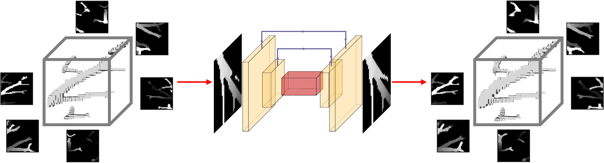
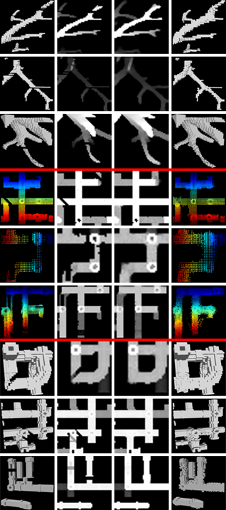

# SBP-Net: Learning Thin Structure Reconstruction with Sliding-Box Projections
<!--
[](https://2026.ieeeicip.org/) 
[](https://opensource.org/licenses/MIT)
-->

This is the official PyTorch implementation for the paper **"SBP-Net: Learning Thin Structure Reconstruction with Sliding-Box Projections"** (IEEE ICIP 2026).

SBP-Net is designed for the localized completion of highly imperfect, thin 3D structures (such as vascular networks and industrial pipelines). By utilizing a sliding-box traversal and 2D orthographic depth projections, our method avoids the complexities of global 3D reconstruction, effectively detecting and repairing topological gaps.

<p align="center">
   <br>
   <em>Representative 3D reconstruction results showing the SBP-Net output on thin structures from medical CT scans and industrial point clouds.</em>
</p>

---

## Method Overview

The SBP-Net pipeline operates by localizing the reconstruction task. It extracts 3D sub-volumes, projects them into 6 orthogonal 2D depth views, repairs the structures using an Attention U-Net, and perfectly fuses the fixed geometry back into the global 3D space using a logical OR operation.

<p align="center">
   
</p>

---

## Installation

Installation includes cloning the repository, creating a virtual environment, and installing the required dependencies. Please note that this project requires **Python 3.10** and uses a manual instruction file for dependencies rather than an automated `requirements.txt`.

```bash
git clone https://github.com/OfirGiladBGU/SBP-Net.git
cd SBP-Net

# Create and activate a Python 3.10 virtual environment
python3.10 -m venv venv
source venv/bin/activate
```

Then follow the [manual_requirements.txt](manual_requirements.txt) instructions.

---

## Data Setup

Our pipeline supports multiple data representations (Voxel Grids, Meshes, and Point Clouds). Below is an example of setting up a medical dataset (e.g., [Parse2022](https://parse2022.grand-challenge.org/)).

1. Place your dataset in `./data/parse2022` with the following structure:
   - `labels`: The 3D ground truth (e.g., Parse2022 Label Segmentation).
   - `preds`: The incomplete/damaged 3D input (e.g., SOTA Predictions - [MEDPSeg](https://github.com/MICLab-Unicamp/medpseg)).

   

2. Select a configuration file in the `configs/` folder (e.g., `parse2022_SC_32.yaml`) and update the `CONFIG_FILENAME` field inside `configs/configs_parser.py`.
3. Build the localized training crops by running:
   ```bash
   python datasets_forge/dataset_2d_creator.py
   ```
   *(Optional)* If you are running 3D-to-3D baseline experiments, also run `dataset_3d_creator.py`.

### Synthetic Generation (PipeForge3D)
If you are generating synthetic holes in complete structures (e.g., using [PipeForge3D](https://github.com/OfirGiladBGU/PipeForge3D)), place the raw data in `./data/PipeForge3D/originals` and run the appropriate generator before proceeding to the crop creation:
- For Meshes/NIfTI: `python datasets_forge/generate_3d_preds_from_mesh.py`
- For Point Clouds: `python datasets_forge/generate_3d_preds_from_pcd.py`

<p align="center">
   <br>
   <em>Examples of 2D orthographic projections generated from the sliding-box crops.</em>
</p>

---

## Training

The repository supports training for three model variations. Training configurations are dynamically loaded from your selected `.yaml` file.

- **2D Model (2D Projection Completion):** Detects and fills holes within the 2D orthographic depth projections.
  ```bash
  python main_2d.py
  ```
- **3D Model (3D Volume Completion):** Performs direct 3D-to-3D volumetric repair.
  ```bash
  python main_3d.py
  ```

> **Note:** The core **SBP-Net** approach relies exclusively on the **2D Model**. However, **3D Model** is used for baselines comparison and future research directions.

---

## Inference & Evaluation

The prediction pipeline integrates the localized repairs back into full 3D models. Outputs are saved to `./data_results/<DATASET_NAME>/predict_pipeline`.

**To run predictions on training/evaluation crops:**
```bash
python offline_pipeline.py
```

**To run predictions directly on new, full 3D volumes:**
```bash
python online_pipeline.py
```

**Evaluation:**
To compute quantitative results (MAE, RMSE, SSIM, Dice, and Chamfer/Hausdorff distances) against ground-truth crops:
```bash
python evaluation_metrics.py
```

---

## Acknowledgments

This code builds upon and compares against several excellent works in the 3D vision community. We thank the authors of the following repositories:
- [Unet3D](https://github.com/wolny/pytorch-3dunet)
- [3D-RecGAN](https://github.com/Yang7879/3D-RecGAN)
- [Conv ONet](https://github.com/autonomousvision/convolutional_occupancy_networks)
- [OReX](https://github.com/haimsaw/OReX)
- [DeepCA](https://github.com/WangStephen/DeepCA)

---

## Citation

If you find this code or our methodology useful in your research, please consider citing our paper:
```bibtex
@inproceedings{gilad2026SBPNet,
    title        = {SBP-Net: Learning Thin Structure Reconstruction with Sliding-Box Projections},
    author       = {Gilad, Ofir and Sharf, Andrei},
    booktitle    = {ICIP},
    year         = {2026},
    organization = {IEEE},
}
```
